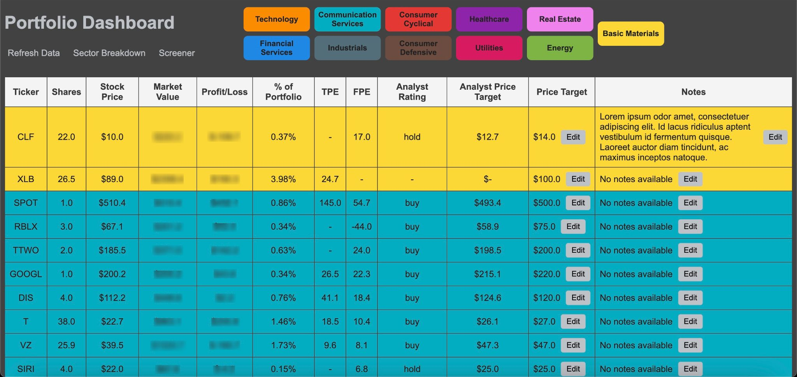
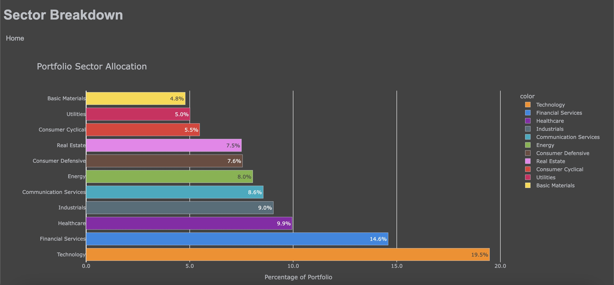
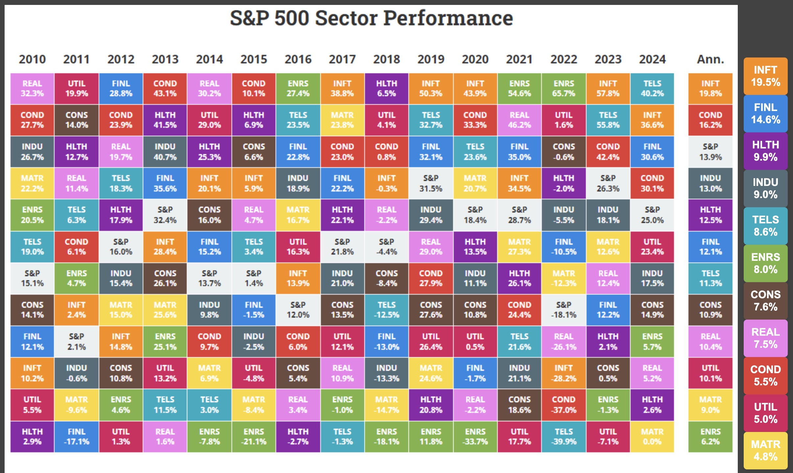

# Portfolio Dashboard Web App  

## Overview  
This web app is a personal investment tool designed to streamline portfolio management and decision-making. It connects to the Schwab Developer API to fetch real-time portfolio data and integrates additional metrics, such as stock price targets and personalized notes, to provide a holistic view of my investments. With features like sector breakdowns and historical performance comparisons, this app helps me make informed investment decisions based on data and insights.  

## Features  

### Portfolio Dashboard  
The home page is a comprehensive portfolio dashboard that displays essential details about my investments. It organizes my holdings by providing key metrics such as stock prices, market value, profit/loss, and percent allocation within my portfolio. I can easily add personalized notes for each stock, document research insights, or track investment strategies. Additionally, the dashboard allows me to set and update custom price targets, helping me make informed decisions with all relevant data at my fingertips.

### Sector Breakdown  
The sector breakdown page offers an in-depth analysis of my portfolio diversification. At its core is a visually engaging bar chart powered by Plotly, which highlights the allocation of my portfolio across various sectors. Each sector is color-coded for clarity, allowing me to quickly assess the strengths and weaknesses of my current diversification strategy. This page provides an intuitive view of my overall investment strategy and highlights areas that may need adjustment.

### Sector Performance Integration  
A unique feature of the sector breakdown page is its integration of past performance data with my current allocations. Using an embedded chart from [Novel Investor](https://novelinvestor.com/sector-performance/), the app displays historical performance for each sector over the past several years. This historical chart is shown alongside my personalized sector allocation, enabling me to easily compare trends and performance against my current investments. This dual perspective helps me better understand the impact of market trends on my portfolio and refine my strategies accordingly.

## Tech Stack  
- **Backend**: Python, Flask, SQLite  
- **APIs**: Schwab Developer API (real-time portfolio data), Yahoo Finance (stock data and analytics)  
- **Frontend**: HTML, CSS, JavaScript, Plotly (interactive visualizations)  

By blending full-stack development with data-driven insights, this app delivers a powerful, intuitive platform for portfolio management.

## Sources
- https://github.com/tylerebowers/Schwab-API-Python/tree/main
    - Go to examples/api_demo.py 
    - See example return values in docs/api.md
- https://www.youtube.com/watch?v=kHbom0KIJwc&t=681s